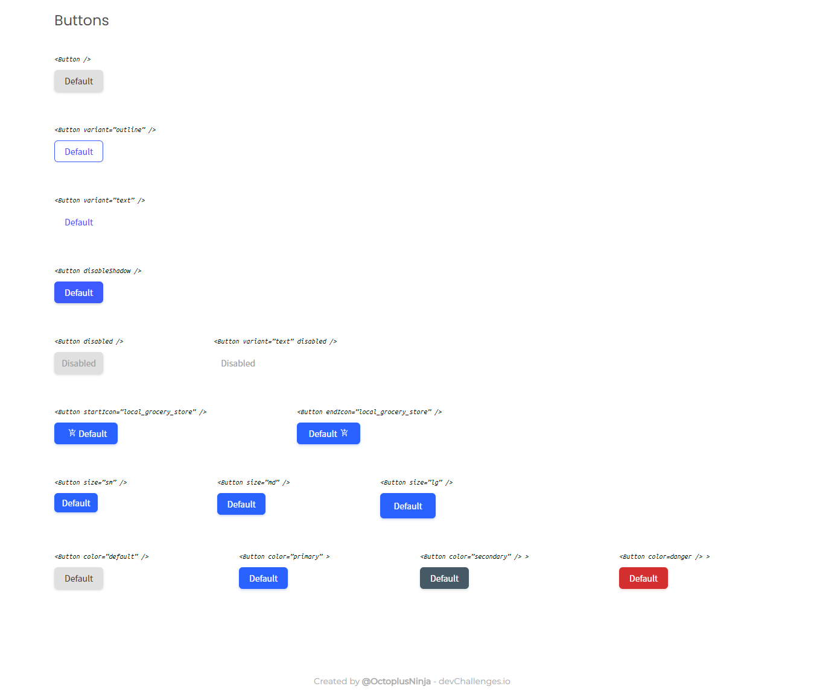
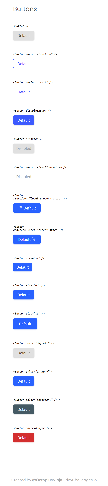

<!-- Please update value in the {}  -->

<h1 align="center">Button Component</h1>

   Solution for a challenge from  <a href="http://devchallenges.io" target="_blank">Devchallenges.io</a>.

  <h3>
    <a href="https://button-component-octoplus.netlify.app/">
      Demo
    </a>
     | 
    <a href="https://devchallenges.io/solutions/dklDmHSmI45eT2Hk0MtO">
      Solution
    </a>
     | 
    <a href="https://devchallenges.io/challenges/ohgVTyJCbm5OZyTB2gNY">
      Challenge
    </a>
  </h3>

<!-- TABLE OF CONTENTS -->

## Table of Contents

- [Overview](#overview)
  - [Built With](#built-with)
- [Features](#features)
- [Contact](#contact)

<!-- OVERVIEW -->

## Overview

|               Desktop View               |               Mobile View               |
| :--------------------------------------: | :-------------------------------------: |
|  |  |

### Built With

<!-- This section should list any major frameworks that you built your project using. Here are a few examples.-->

- [React](https://reactjs.org/)

## Features

<!-- List the features of your application or follow the template. Don't share the figma file here :) -->

This application/site was created as a submission to a [DevChallenges](https://devchallenges.io/challenges) challenge. The [challenge](https://devchallenges.io/challenges/ohgVTyJCbm5OZyTB2gNY) was to build an application to complete the given user stories.

## Contact

- GitHub [@OctoplusNinja](https://github.com/OctoplusNinja)
- Twitter [@isthatAniruddha](https://twitter.com/isthatAniruddha)
